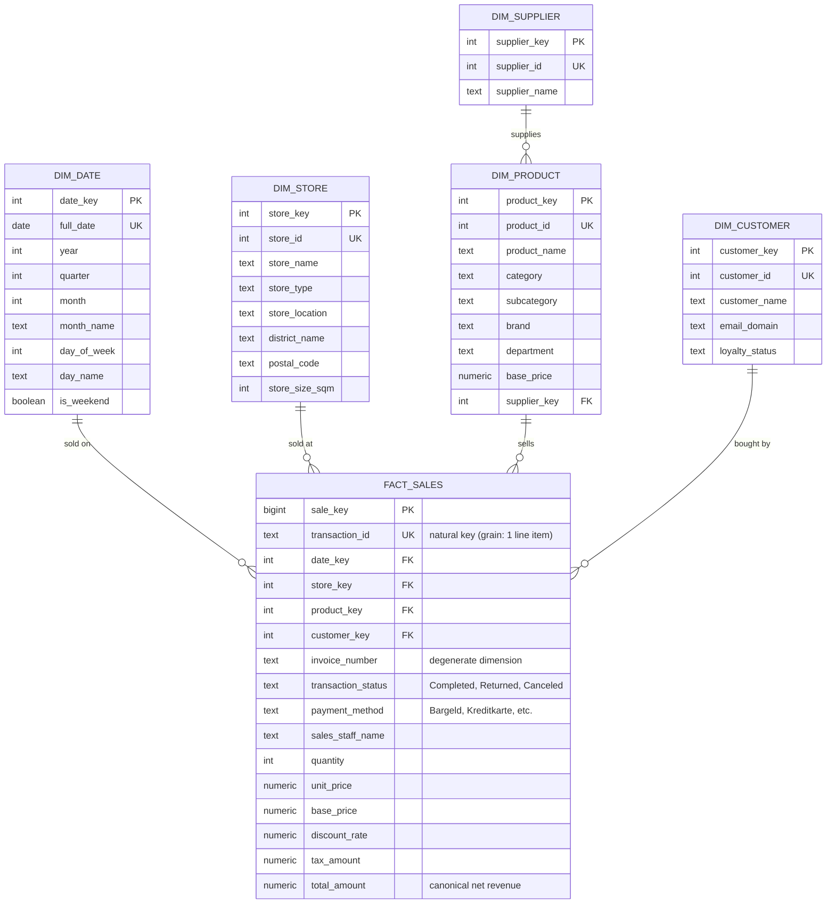

# Entity relationship diagram

Renders natively on GitHub.

> 🔗 **Interactive Schema:** [Explore this diagram interactively on dbdiagram.io](https://dbdiagram.io/d/6a9dadfe5450bea1be01caa6)

## Interactive diagram

View and explore this schema interactively:
- **dbdiagram.io**: [https://dbdiagram.io/d/6a9dadfe5450bea1be01caa6](https://dbdiagram.io/d/6a9dadfe5450bea1be01caa6)

---

## Table Catalog & Purpose

### Fact Table
* **`mart.fact_sales`**:
  * **Grain**: One row per transaction line item (each individual product purchased).
  * **Purpose**: Stores sales measures (`quantity`, `unit_price`, `discount_rate`, `tax_amount`, `total_amount`), foreign keys linking to dimensional context, and low-cardinality degenerate dimensions (`invoice_number`, `transaction_status`, `payment_method`, `sales_staff_name`, `promotion_name`).
  * **Integrity**: `transaction_id` (TEXT) acts as the unique natural key ensuring idempotent upserts.

### Dimension Tables
* **`mart.dim_date`**:
  * **Grain**: 1 row per calendar day (pre-generated across 2024–2026, 1,097 rows).
  * **Purpose**: Conformed date dimension providing calendar roll-ups (year, quarter, month, ISO week) and localized retail flags (`is_weekend`, `is_bavarian_holiday`) to model store closure laws in Munich (*Ladenschlussgesetz*).
* **`mart.dim_store`**:
  * **Grain**: 1 row per physical store location (6 active stores + 1 Unknown placeholder).
  * **Purpose**: Conformed store dimension holding store format (`store_type`), location, floor space (`store_size_sqm`), and flattened Munich geographic attributes (`district_name`, `postal_code`).
* **`mart.dim_product`**:
  * **Grain**: 1 row per retail SKU / catalog item (46 products + 1 Unknown placeholder).
  * **Purpose**: Master product catalog with hierarchy attributes (`category`, `subcategory`, `brand`, `department`, `base_price`) and a foreign key link to its supplier (`supplier_key`).
* **`mart.dim_supplier`**:
  * **Grain**: 1 row per vendor / manufacturer (3 suppliers + 1 Unknown placeholder).
  * **Purpose**: Snowflaked dimension normalizing product supplier entities, isolating vendor name aliases and vendor metadata.
* **`mart.dim_customer`**:
  * **Grain**: 1 row per customer (34 loyalty members + 1 Unknown/Walk-in placeholder).
  * **Purpose**: Tracks customer profile and loyalty tier (`loyalty_status`), with parsed `email_domain` for customer segmentation and support for GDPR pseudonymization.

---

## Key Assumptions

1. **Transaction Grain over Invoice Grain**: 
   * Profiling found that of the 5,416 invoice numbers appearing on multiple rows, **99.6% had conflicting transaction dates, 83.3% had conflicting stores, and 60.2% had conflicting customers**. 
   * `invoice_number` is a synthetic colliding string, not a true basket identifier. The model therefore treats `transaction_id` as the atomic line-item grain and keeps `invoice_number` as a degenerate dimension without joining on it.
2. **Missing Customers are Walk-In Shoppers**:
   * 23.5% (8,380 rows) lack a `customer_id`. These represent cash or guest shoppers who did not use a loyalty card. 
   * Rather than dropping these rows via inner joins or declaring the foreign key nullable, they map to surrogate key `-1` (`"Walk-in"`), preserving 100% of revenue.
3. **Price Arithmetic Priority (Canonical Revenue)**:
   * Profiling verified that `unit_price = base_price * (1 - discount_rate)` held for 100% of testable rows, whereas source `total_amount` had arithmetic errors on over 1,000 rows.
   * `total_amount` in the mart is canonically recomputed as `quantity * unit_price`, while `total_amount_raw` is retained for financial reconciliation and auditability.
4. **Bavarian Retail Trading Regulations**:
   * Under Bavarian state law, retail stores are closed on Sundays and Bavarian public holidays (*Feiertage*). Explicitly modeling these days in `dim_date` prevents anomaly detection algorithms and BI dashboards from misinterpreting zero-sales days as technical outages.
5. **Key Types (`transaction_id`)**:
   * 689 valid transaction records use 10-character alphanumeric strings rather than standard UUIDs. Declaring `transaction_id` as `TEXT` is essential to prevent ingestion failure.

